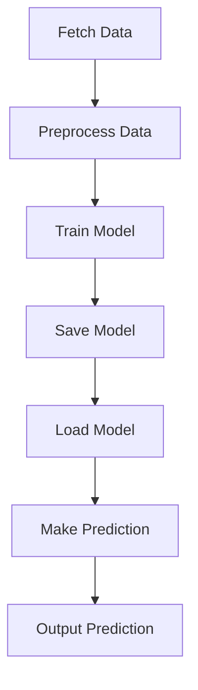

# Heterogeneous Graph Attention Network (HAN) for Predictive Analysis

This repository contains the implementation of a Heterogeneous Graph Attention Network (HAN) designed for predictive analysis using graph neural networks and attention mechanisms. The project leverages Neo4j for graph database management and TensorFlow for machine learning operations.

## Installation

To set up the project environment, follow these steps:

1. Clone the repository:
   ```
   git clone https://github.com/CG-Labs/HAN.git
   ```
2. Navigate to the project directory:
   ```
   cd HAN
   ```
3. Install the required Python packages:
   ```
   pip install -r requirements.txt
   ```

## Usage

To run the predictive analysis script, execute the following command:

```
python ex_acm3025.py
```

The script will download the necessary data, preprocess it, and run the model to make predictions.

## Visualization

The project includes a visualization component that allows you to visualize the graph neural network and attention mechanisms. To view the visualization, open the `visualization.html` file in a web browser.

## Workflow Diagram

Below is a mermaid diagram illustrating the workflow of the project:



This diagram represents the sequence of operations from data acquisition to the final prediction output.

## Requirements

The `requirements.txt` file lists all the necessary Python packages. Ensure you have installed all the dependencies listed in this file before running the project.

## License and Citation

If you use this project or the datasets in your research, please cite the following paper:

```
@article{han2019,
title={Heterogeneous Graph Attention Network},
author={Xiao, Wang and Houye, Ji and Chuan, Shi and Bai, Wang and Peng, Cui and P. Yu and Yanfang, Ye},
journal={WWW},
year={2019}
}
```

The project is released under the MIT License. See the LICENSE file for more details.
