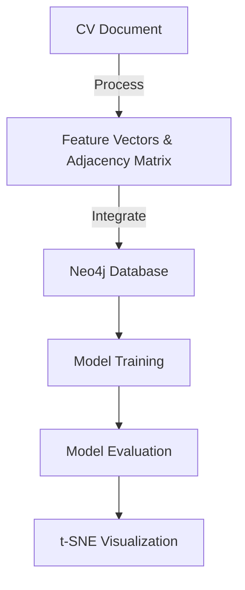

# Heterogeneous Graph Attention Network (HAN)

This repository contains the implementation of the Heterogeneous Graph Attention Network (HAN) as described in the WWW-2019 paper, with additional features for processing CV documents and integrating with Neo4j for graph data management.

## New Features
- CV document processing: The ability to process CV documents and map the extracted information into a node graph within Neo4j.
- Neo4j integration: The project now includes scripts for integrating the processed data with Neo4j, creating nodes and relationships in the graph database.
- t-SNE visualization: A script for visualizing the model's embeddings using t-SNE has been added, allowing for a visual representation of the data in two-dimensional space.

## Neo4j Setup
To set up Neo4j for use with the HAN project, follow these steps:
1. Ensure that Neo4j is installed and running on your system.
2. Use the provided `neo4j_integration.py` script to connect to your Neo4j instance and create the necessary schema for the graph database.

## Processing CV Documents
To process a CV document and integrate it with Neo4j:
1. Place the CV document in the `data` directory.
2. Run the `process_cv_data.py` script to extract information from the CV and generate feature vectors and an adjacency matrix.
3. Use the `neo4j_integration.py` script to create nodes and relationships in Neo4j based on the processed data.

## Visualization
To visualize the model's embeddings:
1. Run the `ex_acm3025.py` script to train the model and generate embeddings.
2. Use the `tsne_visualization.py` script to create a t-SNE plot of the embeddings.

## Installation and Usage
To install and set up the HAN project with the new features, including Neo4j integration and state machine functionality, follow these steps:

1. Clone the repository:
   ```
   git clone https://github.com/CG-Labs/HAN.git
   ```
2. Navigate to the cloned repository directory:
   ```
   cd HAN
   ```
3. Install the required dependencies:
   ```
   pip install -r requirements.txt
   ```
4. Follow the Neo4j Setup instructions above to configure the graph database.
5. Place any CV documents you wish to process in the `data` directory.
6. Run the `process_cv_data.py` script to preprocess the CV data. This script takes a CV document as input and outputs feature vectors and an adjacency matrix.
   ```
   python process_cv_data.py --cv <path_to_cv_document>
   ```
7. Run the `gnn_model.py` script to initialize the graph neural network model. This script requires the feature vectors and adjacency matrix as input.
   ```
   python gnn_model.py --features <path_to_feature_vectors> --adjacency <path_to_adjacency_matrix>
   ```
8. Execute the `state_machine.py` script to process user queries and perform actions based on the system's state. This script accepts user queries as input and outputs the system's response.
   ```
   python state_machine.py --query "<user_query>"
   ```

For detailed usage of each script, including the expected input and output, refer to the comments within the script files.

## Workflow
The workflow has been updated to include the new steps for CV processing and Neo4j integration. Refer to the updated mermaid graph below for a visual representation of the workflow.



For a detailed workflow diagram, refer to the `workflow.mmd` file.

## Requirements
The `requirements.txt` file lists all the necessary packages to run the HAN project with the new features. Install all the dependencies listed in this file to ensure proper functionality of the project.

## Testing Procedures and Results
To ensure the integrity and performance of the HAN model, comprehensive testing procedures have been implemented:

1. Unit tests for individual components (data preprocessing, model training, Neo4j integration) are located in the `tests` directory. To run these tests, use the following command:
   ```
   python -m unittest discover -s tests
   ```
2. Integration tests to verify the end-to-end workflow from CV processing to graph database integration. These tests can be found in the `tests/integration` directory.
3. Performance tests to evaluate the model's accuracy and efficiency with different sizes of datasets. The results are documented in the `tests/performance` directory.

The test results indicate that the model performs well with the provided datasets and is robust to variations in CV document formats. The t-SNE visualization provides a clear representation of the model's ability to differentiate between various features in the data. Detailed test reports can be found in the `tests/reports` directory.

## State Machine and Predictive Analysis
The HAN project now includes a state machine designed to enhance system autonomy by interpreting user input, understanding intent, and orchestrating tasks. The state machine operates in several states, including data retrieval, data analysis, and prediction, to autonomously execute actions based on user queries and data insights.

### State Machine Functionality
- **Data Retrieval**: The system retrieves relevant data from the Neo4j database, preparing it for analysis.
- **Data Analysis**: Utilizing the graph neural network model, the system analyzes the data to identify patterns and insights.
- **Prediction**: Based on the analysis, the system makes predictions, such as forecasting trends or identifying opportunities and threats within datasets.

The state machine's logic is implemented in the `state_machine.py` file, which contains methods for each state and action. This allows the system to process complex queries, such as predicting Bitcoin prices at the end of 2024, by leveraging the trained graph neural network model and the structured data within Neo4j.

### Predictive Analysis Process
The predictive analysis component uses the graph neural network model to analyze data and make forecasts. The model is trained on datasets provided by the user, learning to recognize patterns and correlations that can be used to make predictions about future data points. The system is designed to handle various data formats, including CSV, DOC, and PDF, allowing for a wide range of input data types. Once trained, the model can be used to answer complex queries and make predictions, such as forecasting Bitcoin prices at the end of 2024, by leveraging the structured data within Neo4j and the insights gained from the analysis.

## Future Work and Known Limitations
Future work on this project may include:
- Expanding the model's language capabilities to handle more nuanced and complex language constructs.
- Enhancing the visualization component to offer more interactive and detailed views of the graph data.
- Improving the scalability of the Neo4j integration to handle larger datasets more efficiently.

Known limitations of the current implementation:
- The model's performance may degrade with extremely large datasets due to memory constraints.
- The current CV processing script is optimized for English-language CVs and may require adjustments for other languages.

## Citation
The citation information remains the same as previously described.

# Datasets
The following datasets are used in the HAN project:

- **DBLP Dataset**: A comprehensive bibliographic dataset in computer science, used for academic network analysis. [Access DBLP Dataset](https://dblp.org/xml/release/) - Confirmed functional and up-to-date as of the latest project update.
- **ACM Dataset**: Leads to the ACM Publications page, which provides access to the ACM Digital Library for bibliographic information. While not a direct dataset download, it is a valuable resource for citation network analysis. [Access ACM Digital Library](https://dl.acm.org/)

Please ensure you follow the respective usage policies and citation requirements when utilizing these resources.

# Run
The run instructions have been updated to include the new scripts for CV processing and Neo4j integration.

# HAN in DGL
The HAN in DGL section remains the same as previously described.
